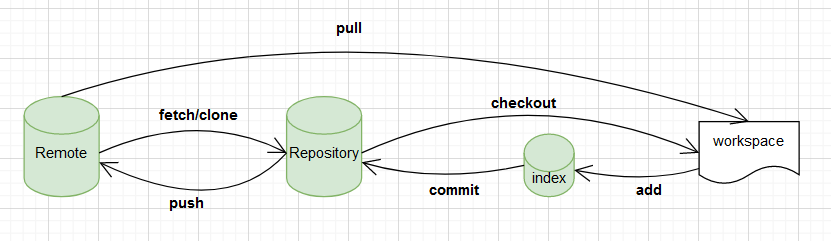

# git都有哪些常用操作呢？

- 1、git的原理（本地和远程，也就是管理的模式）
- 2、git常用命令集合
- 3、git命令使用场景分析
- 4、gitflow流
- 5、展望自动化git部署
- 6、推荐个学习git命令即好玩又有趣的神器网站 Learning Git Branching，它让学习git不再那么枯燥乏味，附上我已经熟练通过图片。

## git的工作原理



- workspace: 工作区，平时存放目录的位置
- index/stage: 暂存区，用例临时存放修改的文件的地方
- Repositiry: 仓库区（或版本库），本地git仓库，git commit后存放的位置
- Remote: 远程仓库，例如github、gitee、gitlab等

## git的常用命令

- 1、git commit:
  将本地暂存区的内容提交至本地git仓库，--amend修改提交info
- 2、git branch:
  git branch newBranch（切换分支）、git checkout -b newBranch（创建新分支并切换至对应分支）
  注意: git 2.23版本中，引入git switch的新命令（比较精简）
  上面的命令会将 main 分支强制指向 HEAD 的第 3 级 parent 提交。
- 3、git merge:
  用于合并另个分支代码的命令，并且会产生一个特殊的提交记录
- 4、git rebase:
  将目标分支的代码移动到指定分支上，git log历史记录不记录
- 5、git reset: 通过把分支记录回退几个提交记录来实现撤销改动。你可以将这想象成“改写历史”。git reset 向上移动分支，原来指向的提交记录就跟从来没有提交过一样。
- 6、給git revert: 会在当前要回退版本的记录上新增加一个提交记录,其中`git revert -m -1 <hash值>`回退指定提交而不影响其他提交，适用于已经提交或者合并过的分支代码的回退。
- 7、git cherry-pick: 不同于`merge`和`rebase`，它主要是合并某几个结点进行合并`git cherry-pick <hash值>`
- 6、 分离HEAD: 在默认情况下HEAD是指向分支的，但也可以将HEAD从分支上取下来直接指向某个节点

## git命令操作场景

### 如何将当前分支指向为历史提交

 在当前分支下执行`git branch -f 当前分支 HEAD~<num>`,num表示前第几次的提交

> 现在有两个开发需求，并分有两个dev分支，一个test测试分支，一个master线上分支，此时正在用一个dev分支开发A需求，并合并到了test分支上，另一个dev分支开发B需求，也合并到了test分支进行测试，但是由于项目规划，A需求暂时不上线，但是B需求要紧急上线，并且master分支的代码只能由test合并来，请求这种方案怎么解决

此时已经从git命令上解决的方案不够成熟，因此对于开发中有多个并行的需求，为了解决多个需求功能之间的干扰和上线时间不确定的问题，可以设置每个需求对应一个dev和一个test测试分支分离需求，保证代码管理的清晰。


> 可以用过`git log`找到指第一次迭代合并的分支hash值，然后通过git revert -m 1 <hash值>

### 线上分支合并代码出现冲突怎么解决

> 当一个项目的同一个文件的同一个位置被两个人同时在两个分支上修改了，并且此时要将两个分支都合并到test测试分支上，当A分支先合并之后B分支再合并发现合并出现冲突，无法线上合并成功。那么怎么解决呢？

此时，发现是因为A分支的代码导致B代码合并过程中的出现冲突，那么这个时候，切换到B分支并更新本地最新的B分支代码，并通过`git merge --no-ff test`查看冲突代码，并在B分支本地修改。修改之后提交，再次合并提交到test分支即可解决

```shell
// 首先，同步自己当前最新代码
git fetch B
git pull B
// 然后切换到远程测试分支test，拉取最新代码
git branch test 
git pull origin test 
// 切换回B分支
git branch B
// 将A分支合并到test分支中的冲突代码合并到本地B分支，并手动解决
git merge --no-ff test 
// 进行B分支代码的提交和线上合并申请提交
git add .
git commit -m 'fix 解决合并冲突'
git push origin B

== 这种情况一般是在本地解决冲突，然后推送到线上 ==
```

### GitHub推送不成功怎么解决

> 当我执行了`git push origin master`将本项目推送至GitHub的时候，经常会出现：fatal: unable to access 'https://github.com/smile199705/base_docs.git/': Failed to connect to github.com port 443 after 75008 ms: Couldn't connect to server
> 那该怎么解决呢

其实可以看我的一篇掘金文章([GitHub不支持git用户名和密码进行pull和push](https://juejin.cn/post/7247694528621477945)),直接执行最后一行代码就可以解决这个问题，说白了就是重新设置用户登录信息从而保障git推送成功。
```shell
git remote set-url origin https://<your_token>@github.com/smile199705/axlejs_ai_code.git
```


## 企业如何规范gitflow
- development分支：开发分支，从master分支拉取
- test分支： 测试完毕后merge到development和master分支
- release分支： 预发布环境或者灰度发布，在master分支发布前进行功能验证的分支
- hotFix分支： 以master分支为基，拉取出来，解决线上业务bug，并合并到test分支完成后，合并到
- master分支：线上分支，每一个版本发布后打一个tag标签，需求版本的跟踪
