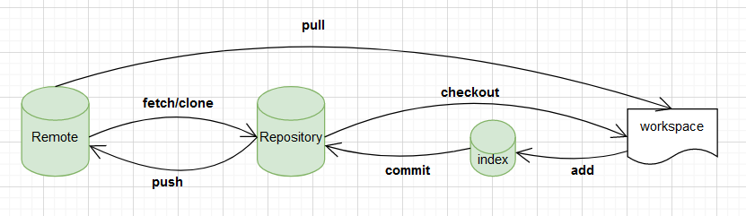

# git都有哪些常用操作呢？

- 1、git的原理（本地和远程，也就是管理的模式）
- 2、git常用命令集合
- 3、git命令使用场景分析
- 4、gitflow流
- 5、展望自动化git部署
- 6、推荐个学习git命令即好玩又有趣的神器网站 Learning Git Branching，它让学习git不再那么枯燥乏味，附上我已经熟练通过图片。

## git的工作原理

- workspace: 工作区，平时存放目录的位置
- index/stage: 暂存区，用例临时存放修改的文件的地方
- Repositiry: 仓库区（或版本库），本地git仓库，git commit后存放的位置
- Remote: 远程仓库，例如github、gitee、gitlab等

## git的常用命令

- 1、git commit:
  将本地暂存区的内容提交至本地git仓库，--amend修改提交info
- 2、git branch:
  git branch newBranch（切换分支）、git checkout -b newBranch（创建新分支并切换至对应分支）
  注意: git 2.23版本中，引入git switch的新命令（比较精简）
  上面的命令会将 main 分支强制指向 HEAD 的第 3 级 parent 提交。
- 3、git merge:
  用于合并另个分支代码的命令，并且会产生一个特殊的提交记录
- 4、git rebase:
  将目标分支的代码移动到指定分支上，git log历史记录不记录
- 5、git reset: 通过把分支记录回退几个提交记录来实现撤销改动。你可以将这想象成“改写历史”。git reset 向上移动分支，原来指向的提交记录就跟从来没有提交过一样。
- 6、給git revert: 会在当前要回退版本的记录上新增加一个提交记录,其中`git revert -m -1 <hash值>`回退指定提交而不影响其他提交，适用于已经提交或者合并过的分支代码的回退。
- 7、git cherry-pick: 不同于`merge`和`rebase`，它主要是合并某几个结点进行合并`git cherry-pick <hash值>`
- 6、 分离HEAD: 在默认情况下HEAD是指向分支的，但也可以将HEAD从分支上取下来直接指向某个节点

## git命令操作场景

### 如何将当前分支指向为历史提交

> 在当前分支下执行git branch -f 当前分支 HEAD~<num>,num表示前第几次的提交

### 当前项目有两个迭代，你做完了第一个迭代（），合并进master分支，并且在新分支开发第二次的迭代，目前领导发话第一次的迭代先不要上了你应该怎么做？

> 可以用过`git log`找到指第一次迭代合并的分支hash值，然后通过git revert -m 1 <hash值>

## 企业如何规范gitflow
